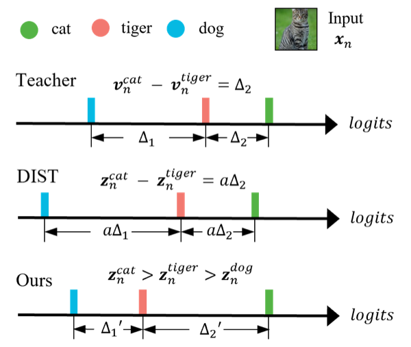
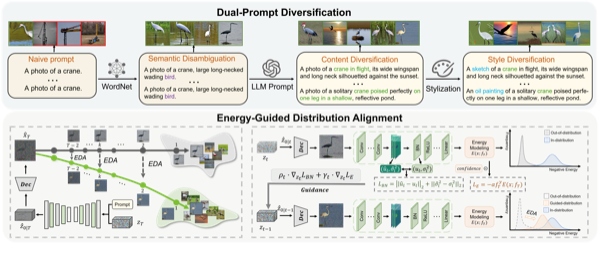
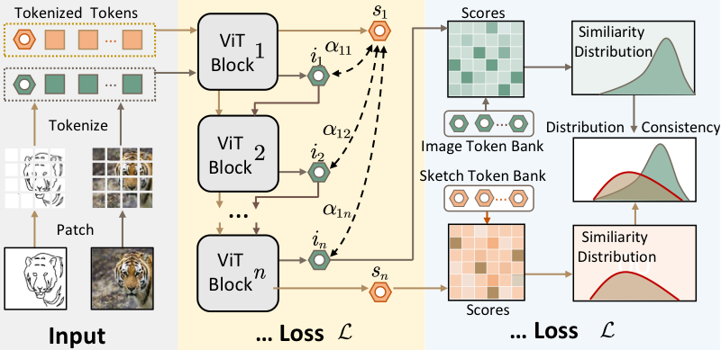

  
  

    <h1>Xuewan He</h1>
    

      <strong>PhD Student</strong> 
      University of Electronic Science and Technology of China (UESTC) 
      Chengdu, China
    

    

      📧 <a href="mailto:hershel@std.uestc.edu.cn">hershel@std.uestc.edu.cn</a>
      &nbsp;·&nbsp;
      <a href="https://scholar.google.com/citations?user=NBQNxVkAAAAJ">Google Scholar</a>
      &nbsp;·&nbsp;
      <a href="https://github.com/Hershel1215">GitHub</a>
      &nbsp;·&nbsp;
      <a href="https://hershel1215.github.io/blog">Personal Blog</a>
    

  

---

## Biography

I am a PhD student at the University of Electronic Science and Technology of China (UESTC).
My research interests include **knowledge distillation**, **zero-shot learning**, and **vision-language models**.

*Feel free to contact me if you are interested in discussing or collaborating.*

## News

- 🎉 **[Feb. 2026]** Co-first-author paper *WaveKD: A Unified Frequency-Aware Distillation Framework for SAR Ship Recognition* accepted at **ICME 2026** (CCF-B).
- 🎉 **[Feb. 2026]** First-author paper *Monotonic Rank Knowledge Distillation via Kendall Correlation* accepted at **IEEE Transactions on Circuits and Systems for Video Technology (TCSVT)** (CAS Q1).
- 🎉 **[Jan. 2026]** First-author paper *PRISM: Precision-Recall Informed Data-Free Knowledge Distillation via Generative Diffusion* accepted at **ICASSP 2026** (CCF-B).
- 🎉 **[Apr. 2024]** First-author paper *Cross-Domain Feature Semantic Calibration for Zero-Shot Sketch-Based Image Retrieval* accepted at **ICME 2024** (CCF-B).

## Publications

### Selected First-Author Papers

  
  TCSVT 2026
  <b><a href="https://doi.org/10.1109/TCSVT.2026.3662408" target="_blank">Monotonic Rank Knowledge Distillation via Kendall Correlation</a></b> 
  <b>Xuewan He</b>, J. Wang, Y. Su, D. Liu, J. Zhao, G. Lu 
  <em>IEEE Transactions on Circuits and Systems for Video Technology</em>, 2026 &nbsp;·&nbsp; CAS Q1
  

  
  ICASSP 2026
  <b><a href="https://arxiv.org/abs/2509.16897" target="_blank">PRISM: Precision-Recall Informed Data-Free Knowledge Distillation via Generative Diffusion</a></b> 
  <b>Xuewan He</b>, J. Wang, Z. Cheng, Y. Su, S. Huang, G. Lu 
  <em>IEEE International Conference on Acoustics, Speech and Signal Processing</em>, 2026 &nbsp;·&nbsp; CCF-B
  

  
  ICME 2024
  <b><a href="https://ieeexplore.ieee.org/document/10687519" target="_blank">Cross-Domain Feature Semantic Calibration for Zero-Shot Sketch-Based Image Retrieval</a></b> 
  <b>Xuewan He</b>, J. Wang, Q. Xia, G. Lu, Y. Tang, H. Lu 
  <em>IEEE International Conference on Multimedia and Expo</em>, 2024 &nbsp;·&nbsp; CCF-B
  

### Co-authored Papers

- ICME 2026 &nbsp; Cencen Liu\*, **Xuewan He**\*, Zihan Cheng, et al. WaveKD: A Unified Frequency-Aware Distillation Framework for SAR Ship Recognition &nbsp;·&nbsp; CCF-B &nbsp;·&nbsp; <em>Co-first Author</em>
- ICME 2026 &nbsp; Jinxin Yang, **Xuewan He**, Jielei Wang, et al. LatentDFKD: Resolving Ill-Posed Pixel Inversion in Data-Free Distillation through Latent Modeling &nbsp;·&nbsp; CCF-B
- AAAI 2026 &nbsp; Shiyue Huang, Yuchen Su, ..., **Xuewan He**, et al. [Towards Distance-Invariant Radio Frequency Fingerprinting via Augmented Unsupervised Learning]() &nbsp;·&nbsp; CCF-A
- ICASSP 2026 &nbsp; Zihan Cheng, Yansong Lin, **Xuewan He**, et al. [SSCR: Efficient Multimodal Cloud Removal Framework via Exploiting Structural Semantics in SAR]() &nbsp;·&nbsp; CCF-B
- TST 2025 &nbsp; Qianxin Xia, Jielei Wang, **Xuewan He**, et al. [PEAK: Pure Logit Distillation via Multi-granularity Knowledge Transfer](https://doi.org/10.26599/TST.2026.9010008) &nbsp;·&nbsp; CAS Q2
- TCE 2024 &nbsp; Chengyu Ning, Guoming Lu, **Xuewan He**, et al. [Learning Communication With Limited Range in Multi-Agent Cooperative Tasks](https://doi.org/10.1109/TCE.2024.3502210) &nbsp;·&nbsp; CAS Q2

## Education

- **Ph.D.** in Computer Science, UESTC · Institute of Intelligent Computing &nbsp;·&nbsp; Sep. 2024 – Present
- **M.S.** in Computer Science, UESTC · School of Computer Science &nbsp;·&nbsp; Sep. 2022 – Jun. 2024
- **B.S.** in Computer Science, UESTC · School of Computer Science &nbsp;·&nbsp; Sep. 2018 – Jun. 2022

